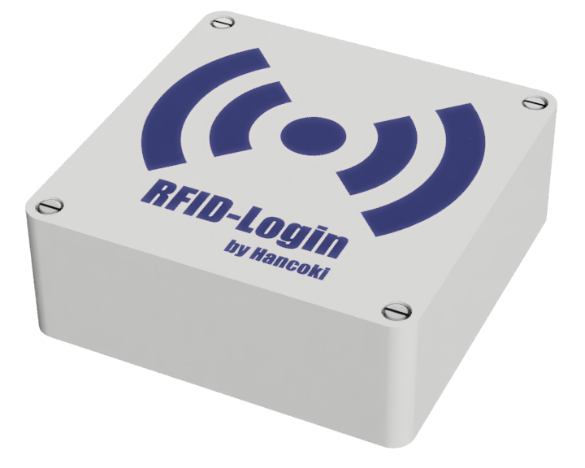
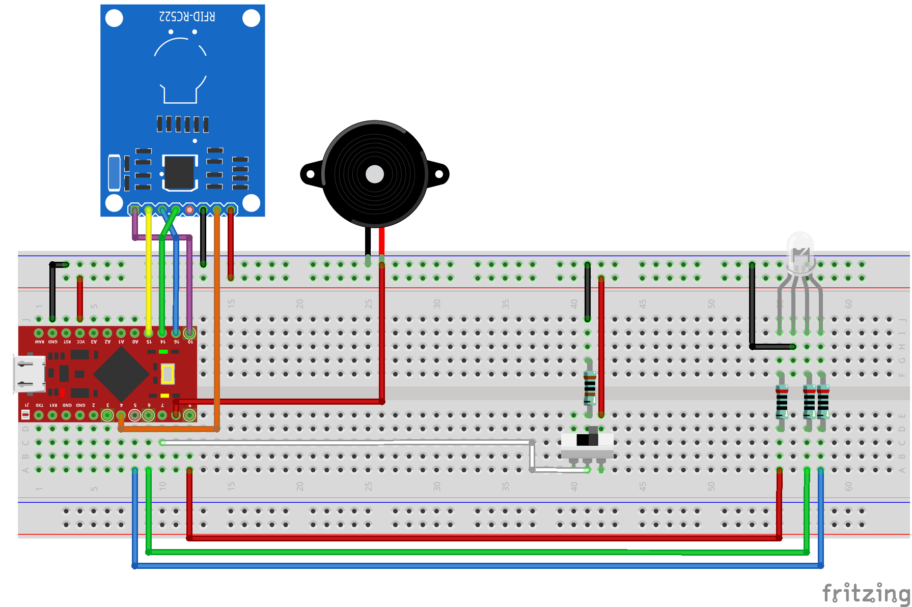

# RFID-login

## Description

This is a RFID login device based on the microcontroller [Sparkfun Pro Micro](https://github.com/sparkfun/Pro_Micro). It allows easy to type in your login credentials in same way as your keyboard does. But it seems a little bit smarter.

In first step I developed this device as a prototype on a breadboard. For the device I used the following components.

### Bill of material

- SparkFun Pro Micro 3.3V/8MHz microcontroller
- RFID MFRC522 reader & IC card
- circuit board size 70mm x 50mm
- USB mini cable (USB-A male/USB-B male) ~1m
- resistors 3x 200Ohm, 1x 100Ohm
- RGB led
- switch
- piezo buzzer

### Wiring

As you can see in schematic above I wired the pins of microcontroller as follows:

Pin | Function      | Pin   | Function
--- | --------      | ---   | --------
4   | RST (RFID)    | 10    | SDA (RFID)
5   | LED (blue)    | 14    | MISO (RFID)
6   | LED (green)   | 15    | SCK (RFID)
7   | switch        | 16    | MOSI (RFID)
8   | buzzer        | GND   | GND
9   | LED (red)     | VCC   | 3.3V (RFID)

### Programming

For programming the Pro Micro I used [PlatformIO](https://github.com/platformio/platformio-core) inside of [VS CODE](https://github.com/microsoft/vscode).

Included libraries:
- [Keyboard library for Arduino](https://www.arduino.cc/reference/en/language/functions/usb/keyboard/)
- [Arduino library for MFRC522 by miguelbalboa](https://github.com/miguelbalboa/rfid)

## What comes next?

For a future version of my RFID login device I plan to decrement the size of case and develop a custom circuit board for it. Also a possibility to program the device instant without compiling the code again and again would be very nice.

If you have any questions or ideas for improvement, please let me know and write an issue.

Thanks for your participation!